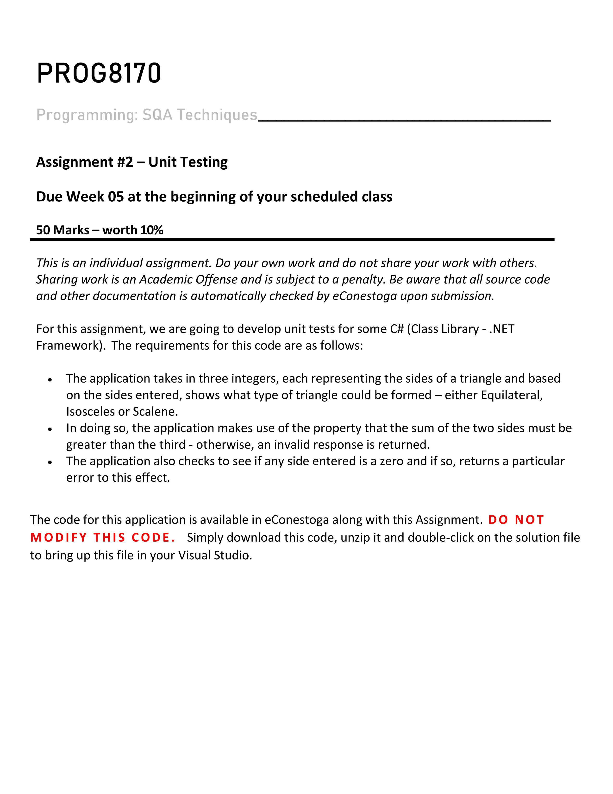
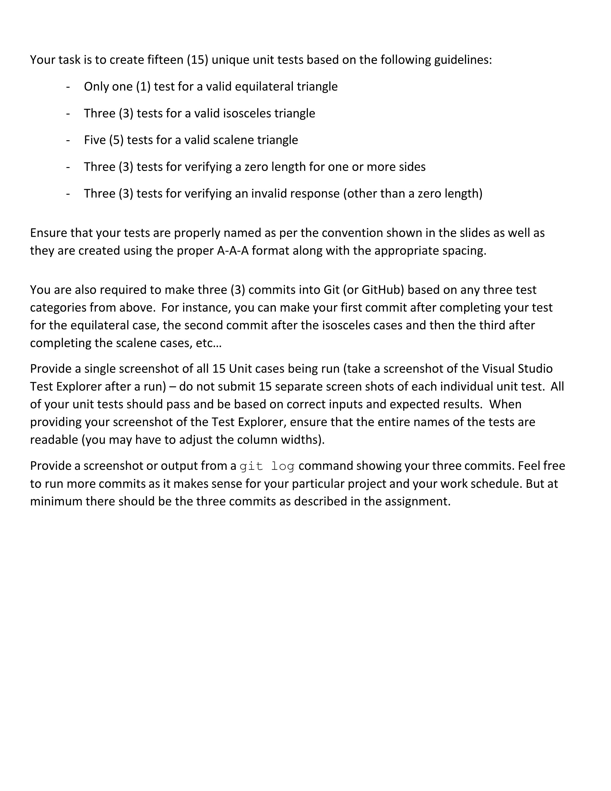
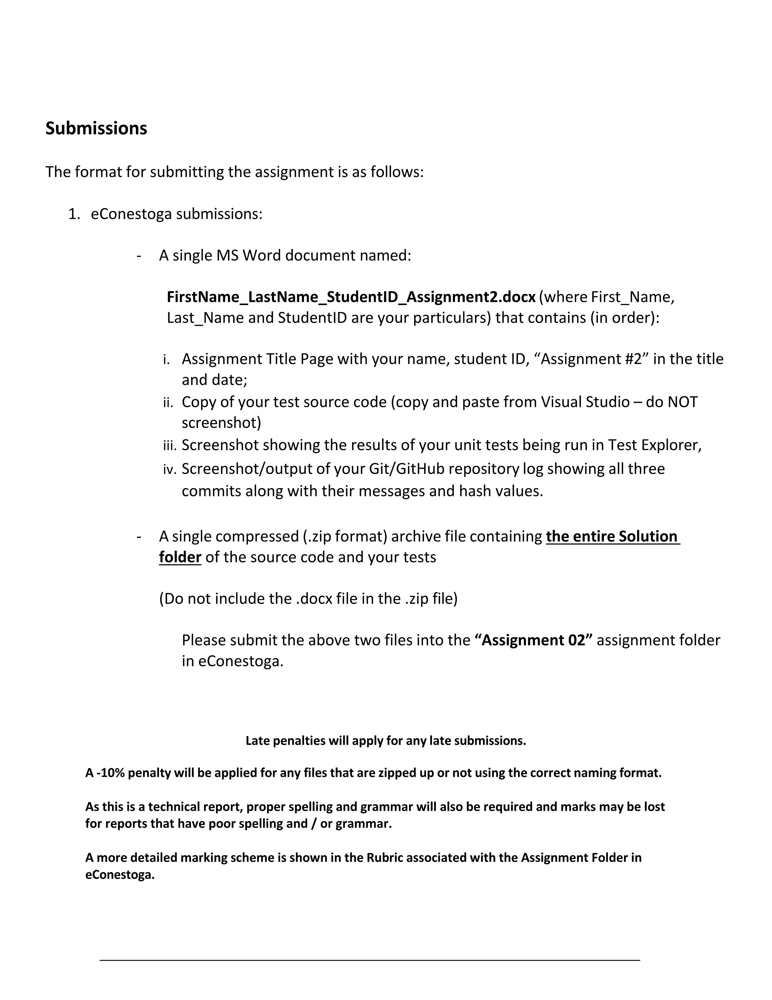
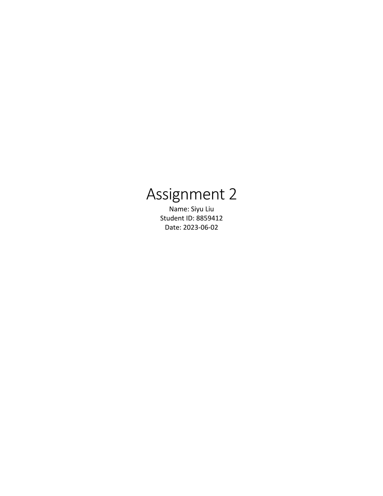
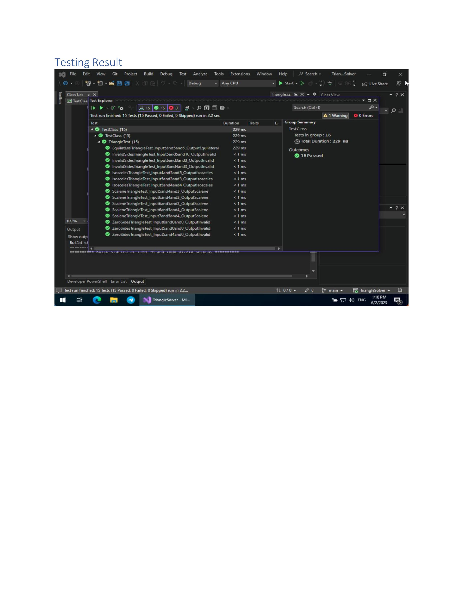
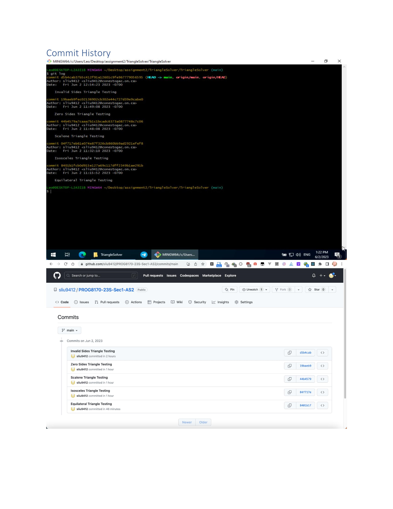

# PROG8170-23S-Sec1-Software-Quality-Assurance-Assignment2-Unit-Testing

For this assignment, we are going to develop unit tests for some C# (Class Library - .NET Framework). The requirements for this code are as follows:

The application takes in three integers, each representing the sides of a triangle and based on the sides entered, shows what type of triangle could be formed – either Equilateral, Isosceles or Scalene.

In doing so, the application makes use of the property that the sum of the two sides must be greater than the third - otherwise, an invalid response is returned.

The application also checks to see if any side entered is a zero and if so, returns a particular error to this effect.

## Requirements

## Project For Testing (C#)

[TriangleSolver.zip](./doc/TriangleSolver.zip)

## DOC

